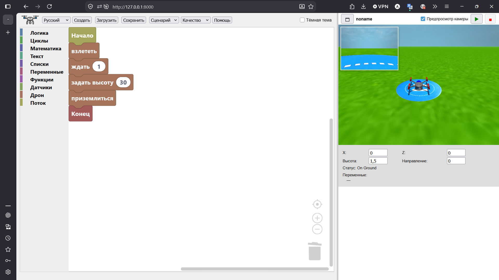
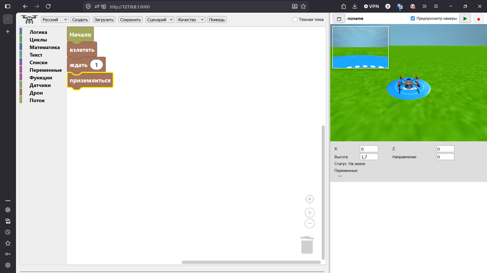
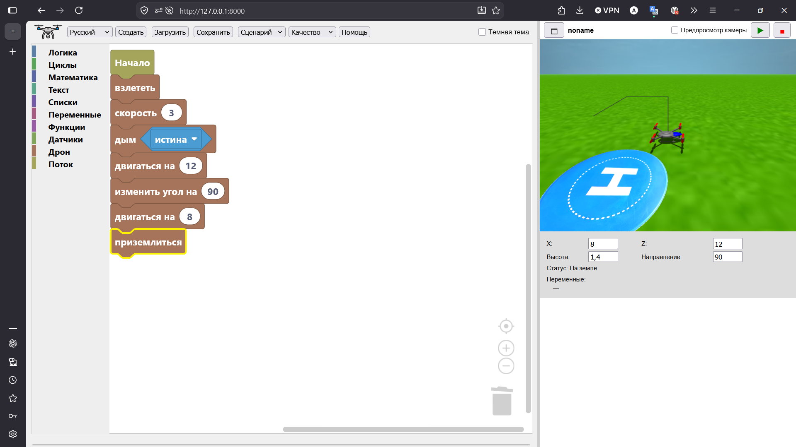

# Drone Commander RU



Drone Commander — интерактивное веб-приложение для программирования и симуляции полёта дрона с помощью Blockly и Three.js. Соберите план полёта из блоков, запустите программу и наблюдайте за дроном в трёхмерной среде.

Данный репозиторий содержит русскую локализацию интерфейса оригинального проекта Drone Commander.
Переведены элементы интерфейса, названия команд и другие текстовые элементы программы.
Проект не является официальной русской версией Drone Commander.

## Демо

Откройте веб-версию:

https://vroby65.github.io/DroneCommander/

## Возможности

- **Визуальное программирование** с блоками Blockly для логики, циклов, математики, переменных, функций, датчиков и команд дрона.
- **Трёхмерная симуляция** на Three.js с учётом рельефа при взлёте и посадке.
- **Аварийная обработка столкновений**: программа Blockly останавливается, а дрон быстро приземляется в последней безопасной точке.
- **Команды дрона**: взлететь, приземлиться, сделать фото, начать запись, сохранить запись, задать или изменить высоту и угол, двигаться, двигаться вперёд с подъёмом, сместиться, перейти в абсолютную точку, переместиться относительно текущего направления, пролететь по кривой, вернуться на базу, ждать, включить дым и задать скорость.
- **Плавный полёт по кривой**: траектория задаётся координатами и не меняет направление дрона.
- **Блоки датчиков**: нажатие клавиш, координаты X/Z, высота, направление и скорость.
- **Сценарии**: лётное поле, городская трасса, мегаполис и тропический остров.
- **Профили графики**: производительность, сбалансированный и высокое качество.
- **Бортовая камера** с окном предварительного просмотра от носа дрона. Камера повторяет поворот, тангаж и крен; фото PNG и видео можно скачать с отметкой времени.
- **Светлая и тёмная темы** интерфейса и рабочей области Blockly. Выбранная тема сохраняется в локальном хранилище браузера.
- **Масштабирование блоков**: кнопки увеличения, уменьшения и сброса масштаба, прокрутка колёсиком мыши и жест масштабирования.
- **Управление программами**: создать, сохранить, загрузить; автоматическое сохранение в браузере и запоминание имени файла.
- **Полёт на Ryze/DJI Tello** через сопутствующую программу [Drone Commander Tello Driver](https://github.com/vroby65/DroneCommander-Driver).
- **Многоязычный интерфейс и справка**: английский, итальянский, французский, немецкий, испанский, португальский, русский, арабский, упрощённый китайский, корейский и японский языки.
- **Изменяемая компоновка**: редактор Blockly, окно 3D-сцены и панель телеметрии со значениями переменных программы.

## Скриншоты

### Взлёт и посадка



### Скорость и дымовой след



## Запуск локально

Клонируйте репозиторий и запустите любой статический HTTP-сервер:

```sh
git clone https://github.com/vroby65/DroneCommander.git
cd DroneCommander
python3 -m http.server 8000
```

Затем откройте в браузере:

```text
http://127.0.0.1:8000/
```

Рекомендуется запускать приложение через HTTP-сервер: оно загружает сценарии, текстуры, модели, звуки и страницы справки из локальных файлов.

## Использование

1. Перетащите блок **Начало** в рабочую область Blockly.
2. Добавьте команды дрона, например **взлететь**, **задать высоту**, **двигаться на**, **двигаться вперёд с подъёмом**, **перейти в**, **сместиться на**, **пролететь по кривой abs**, **пролететь по кривой**, **сделать фото**, **начать запись**, **сохранить запись**, **вернуться на базу**, **изменить угол на** и **приземлиться**.
3. Нажмите зелёную кнопку запуска, чтобы выполнить программу в 3D-сцене. После завершения дрон останется в конечной точке. Нажмите запуск ещё раз, чтобы сбросить дрон и повторить программу, или кнопку остановки, чтобы сбросить его без повторного запуска.
4. В панели под 3D-сценой просматривайте или изменяйте координаты X и Z, высоту, направление и состояние полёта. Во время выполнения там также отображаются все переменные Blockly и их текущие значения.
5. Включите флажок **Предпросмотр камеры** на панели 3D-сцены, чтобы показать вид с бортовой камеры в левом верхнем углу. Предпросмотр доступен и в полноэкранном режиме.
6. Добавьте блок **сделать фото**, чтобы сохранить PNG-снимок с бортовой камеры в нужный момент программы. Предпросмотр для этого включать не обязательно.
7. Перед снимаемыми действиями добавьте блок **начать запись**, а после них — **сохранить запись**. Запись работает и при скрытом предпросмотре; если остановить программу до сохранения, запись будет отменена.
8. Выберите **Тёмная тема** в верхней части редактора Blockly, чтобы переключить оформление всего интерфейса.
9. Масштабируйте блоки кнопками управления масштабом Blockly, колёсиком мыши или жестом масштабирования.
10. Нажмите **Сохранить** или **Загрузить**, чтобы экспортировать или импортировать программу Blockly в формате XML.
11. При необходимости выберите сценарий или профиль графики на панели инструментов.

## Бортовая камера

Дополнительная камера отображает ту же среду Three.js из точки крепления перед носом дрона. Её положение и ориентация рассчитываются в локальных координатах дрона, поэтому изображение повторяет повороты, набор и снижение высоты, а также крен.

Предпросмотр расположен в левом верхнем углу основной 3D-сцены и занимает одну восьмую её площади, не влияя на размеры панелей и компоновку. Его можно включать и выключать флажком **Предпросмотр камеры**; настройка сохраняется в локальном хранилище браузера. Предпросмотр остаётся видимым в полноэкранном режиме. Отдельная цель рендеринга камеры используется блоками **сделать фото**, **начать запись** и **сохранить запись**.

Видео записывается с частотой 30 кадров/с и соотношением сторон 4:3, с разрешением до 960×720. В зависимости от поддержки браузера приложение выбирает WebM (VP9 или VP8) либо MP4. Блок **сохранить запись** завершает запись и скачивает видеофайл с отметкой времени.

В панели телеметрии есть настройка **Папка фото/видео**. В браузерах с поддержкой выбора папки для записи можно один раз выбрать каталог, куда будут сохраняться фотографии и готовые видеозаписи. Выбранная папка запоминается; после перезапуска браузер может повторно запросить разрешение. Из соображений конфиденциальности браузер показывает только имя папки, а не полный путь. Если браузер не поддерживает эту функцию, нет разрешения или возникла ошибка записи, приложение использует обычную загрузку файлов.

Firefox пока не поддерживает API [`showDirectoryPicker()`](https://developer.mozilla.org/en-US/docs/Web/API/Window/showDirectoryPicker), необходимый для выбора папки. Поэтому в Firefox выбор папки скрыт и файлы скачиваются обычным способом. Папку загрузок или запрос места сохранения каждого файла можно настроить в Firefox в разделе **Настройки → Основные → Файлы и приложения → Загрузки**. Эта настройка браузера применяется ко всем загрузкам, а не только к Drone Commander.

## Аварийная посадка при столкновении

Каждая заданная точка полёта проверяется на пересечение с рельефом и объектами сцены. Если траектория ведёт внутрь препятствия, Drone Commander немедленно отменяет текущую команду и очередь команд, останавливает программу Blockly и отменяет активную видеозапись.

Дрон возвращается в последнюю точку без столкновений и выполняет аварийную посадку на поверхность под ним за 300 мс. Тангаж и крен выравниваются, после касания земли останавливаются пропеллеры и звук двигателя, после чего кнопка запуска снова становится доступной. Обычные взлёт и посадка учитывают рельеф и не запускают аварийную процедуру.

## Полёт на настоящем Tello

Сопутствующая программа [Drone Commander Tello Driver](https://github.com/vroby65/DroneCommander-Driver) — приложение на Go/Fyne. Оно загружает XML-файлы, сохранённые в Drone Commander, и выполняет программы на Ryze/DJI Tello через Tello SDK 2.0.

Создайте и проверьте программу в симуляторе, сохраните её в XML и откройте в драйвере. Перед подключением к сети Wi-Fi дрона `TELLO-...` повторно проверьте программу в автономном режиме симуляции драйвера. Для полётов в помещении драйвер считает одну единицу Drone Commander равной одному сантиметру и ограничивает перемещения согласно лимитам Tello, описанным в README драйвера.

## Относительные координаты перемещения

Блок **сместиться на** задаёт X/Y/Z относительно текущего направления дрона. X перемещает вправо или влево, Y — вверх или вниз, Z — вперёд или назад. Поворот дрона изменяет оси X и Z, а ось Y всегда остаётся вертикальной.

## Полёт по кривой

Блоки **пролететь по кривой** и **пролететь по кривой abs** прокладывают путь через текущую позицию, промежуточную точку и конечную точку. По возможности траектория сглаживается дугой и не меняет направление дрона. Дуга рассчитывается в трёхмерной плоскости, заданной этими точками, поэтому путь может быть горизонтальным, вертикальным или наклонным.

Во время движения по кривой дрон наклоняется в повороте. Поэтому последовательные команды полёта по кривой выполняются плавно, без отдельных пауз на наклон и выравнивание.

В блоке **пролететь по кривой abs** промежуточная и конечная точки задаются абсолютными координатами программы. В блоке **пролететь по кривой** координаты X/Y/Z задают смещение от текущей позиции, а XD/YD/ZD — смещение от промежуточной точки. Оба смещения поворачиваются вместе с дроном: Z задаёт движение вперёд/назад, X — вправо/влево.

## Структура проекта

- `index.html` — каркас приложения, компоновка и порядок загрузки скриптов.
- `js/blockly.js` — пользовательские блоки Blockly, генераторы JavaScript, светлая и тёмная темы редактора, настройка панели блоков и сохранение рабочей области.
- `js/drone-commands.js` — симуляция Three.js, основная и бортовая камеры, очередь команд, управление полётом, сценарии, обработка столкновений, звук и отрисовка.
- `js/ui.js` — управление камерой, переключение тем, поля телеметрии, отслеживание переменных, действия с программами, компоновка, локализация и списки выбора.
- `js/app.js` — запуск приложения: локализация, Blockly, Three.js и цикл отрисовки.
- `doc/` — справочные страницы на поддерживаемых языках.
- `backgrounds/` — описания сценариев.
- `models/` — модели дрона и объектов сцены.
- `textures/` — текстуры земли, неба и объектов.
- `sounds/` — звуковые файлы дрона.
- `libs/` — библиотеки Blockly и Three.js.
- `screenshots/` — скриншоты приложения для README.

## Оригинальный проект

Оригинальный проект:

https://github.com/vroby65/DroneCommander

Данный репозиторий является производной работой на основе оригинального проекта.

## Автор локализации

Русская локализация:

Alex-Abat, 2026

## Лицензия

Оригинальный проект распространяется на условиях MIT License.

Copyright (c) 2025 vroby65

Полный текст лицензии находится в файле [LICENSE](LICENSE).

Данный репозиторий сохраняет условия лицензирования оригинального проекта.

## Благодарности

Спасибо автору оригинального проекта за создание Drone Commander.

* Original project: https://github.com/vroby65/DroneCommander
* Original author: vroby65
* License: MIT
